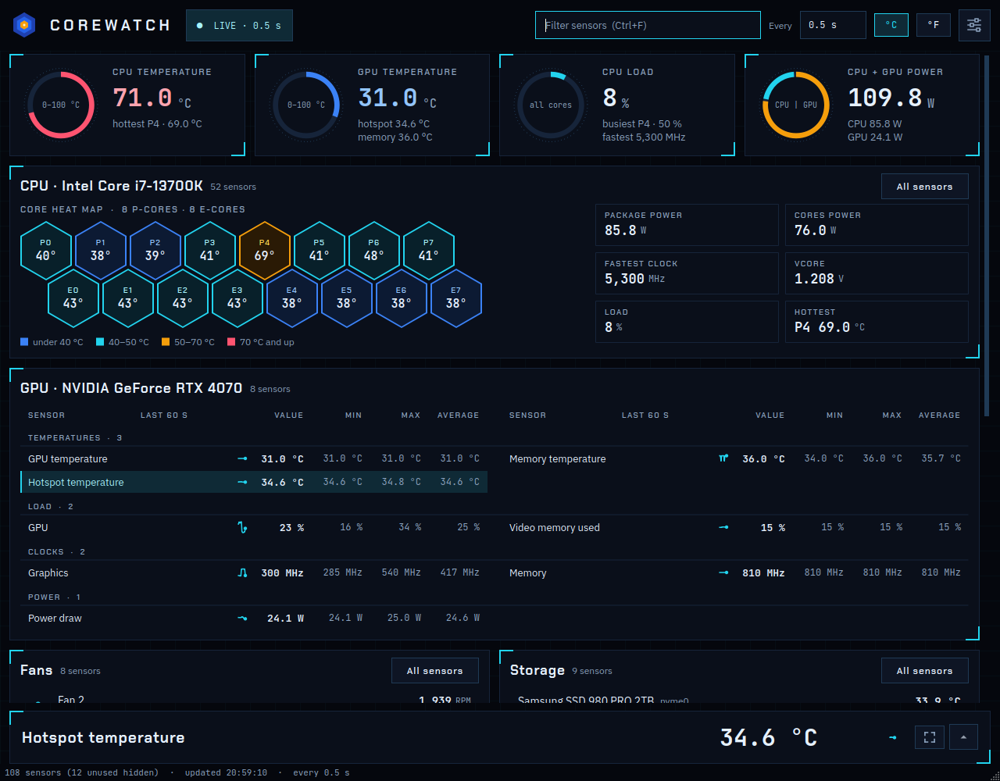

<p align="center"></p>

# corewatch

A Core Temp-style hardware monitor for Linux. It shows every temperature, fan speed, voltage, clock,
load and power reading your machine exposes, refreshes them at an interval you choose (0.25 s to
60 s), and keeps a minimum, maximum, average and 15-minute history for each one.

<picture>
  <source media="(prefers-color-scheme: dark)" srcset="docs/screenshot.png">
  <source media="(prefers-color-scheme: light)" srcset="docs/screenshot-light.png">
  
</picture>

## Features

- **Overview gauges** across the top for the numbers you check most: CPU temperature (with the
  hottest core), GPU temperature (with the card's other temperatures, like hotspot and memory),
  CPU load (with the busiest core and the fastest core's clock) and CPU + GPU power (the ring split
  between the two). With a graphics card next to integrated graphics, the gauges follow the card;
  integrated graphics' power is never added to the CPU's, since the CPU's figure already includes
  it. Click a gauge (or Tab to it and press Enter) to open that sensor in the detail drawer. A gauge
  only appears if your hardware reports its sensor.
- **Core heat map.** The CPU card shows its cores as a honeycomb, each tinted by temperature
  (under 40 °C, 40–50, 50–70, 70 and up), so a hot core stands out at a glance. Intel hybrid
  CPUs get a row of P-cores and a row of E-cores. AMD CPUs report one temperature per chiplet
  rather than per core, so a Ryzen with two or more chiplets shows those, and one with a single
  chiplet (or an APU) has no map. Click a core, or use the arrow keys and Enter, to see its history.
- **One card per device** (CPU, GPU, motherboard, network card), plus a **Fans** card that
  gathers every fan from the motherboard and the GPU, and a **Storage** card with every drive (the
  detail drawer still names the device each sensor belongs to). The CPU and GPU cards span the
  window; the rest sit two to a line when the window is wide enough.
- **Each card opens on a view made for its device:**
  - **CPU:** the heat map, with tiles for package and cores power, the fastest clock, load, the
    hottest core and Vcore (where the board's chip or zenpower reports it).
  - **Fans:** each fan's speed, a bar of how hard it's driven (its fan control setting where
    there is one, else its speed against its own fastest), and where it is.
  - **Storage:** each drive's temperature on a bar marked where the drive starts to warn.
  - **Motherboard:** its named voltage rails.
  - **Network:** download and upload, each with its last minute drawn, and the card's
    temperatures.

  Click an item, or Tab to the view and use the arrow keys and Enter, to open its sensor.
  **All sensors** in a card's header shows its full list under the view, and corewatch remembers
  which cards you left open that way. The GPU card, and any card with nothing for a view, is its
  full list. While you filter, every card lists just the sensors that match.
- **The full list** groups a card's sensors under Temperatures, Load, Clocks, Power, Fan speed,
  Fan control, Voltages and Traffic, in two columns. Each row has a 60-second sparkline, the
  current value, min, max and average.
- **Detail drawer** along the bottom for the selected sensor. Shut, it's one line: the sensor, its
  value and its last minute, so the cards get the window. Click a sensor, or that line, to open it
  to a 1, 5 or 15 minute chart with the hardware's limits drawn as dashed lines. Hover over the
  chart to read any point's value and time. Below the chart: lowest and highest (with the time each
  happened), averages for the session, the last minute and the last 5 minutes, variation, trend,
  and time spent past a limit or at critical. Drag its edge to resize it; it reopens at that
  height. Esc, its arrow, or clicking the shown sensor again shuts it.
- **Focus view.** Double-click any sensor (in a card, a gauge or the heat map), or use the focus
  button in the detail drawer, to see it across the whole window:
  - a dial with the reading against its scale, its high limit marked and its critical zone
    shaded. Sensors with no natural scale (voltages, clocks, fan RPM, traffic) show the number
    alone;
  - the headroom to its limit, and which way it's heading;
  - a large chart that always keeps the limits in view, with its peak and a 1-minute average;
  - every statistic, each with a word on what it means.

  For a CPU sensor, **Every core** charts each core's temperature over the same minutes on one
  scale, with its peak and clock; click a core to focus on it. Rename and Pin to tray work from
  here too. **‹ ›** (or Ctrl+PgUp and Ctrl+PgDn) step to the previous or next sensor in the
  overview's order, without going back. Esc or **Back** goes back, and so does typing in the
  filter.
- **Readable names.** Intel hybrid CPUs show P-core 0-7 and E-core 0-7 instead of the kernel's
  gappy core IDs. Nuvoton motherboard chips get named voltage rails (Vcore, +12V, +5V, +3.3V, ...).
  Right-click any sensor and choose **Rename…** to give it your own name (handy for "Fan 2" →
  "CPU fan"); **Reset name** undoes it.
- **Tray icon.** corewatch's logo sits in the tray, in one colour like the desktop's own icons
  there. Its menu opens the window and has every option the window has: reset min/max, update
  interval, °C/°F, the min/max columns, and everything in the settings menu, through to Quit.
  Double-click it (or, on desktops where a click doesn't open the menu, click it) to bring the
  window up.
- **Pin sensors to the tray.** Right-click a sensor and choose **Pin to tray**, or use the button
  in the detail drawer. Each pinned sensor gets its own tray icon showing its number, like Core
  Temp's per-core icons. Right-click one to see its group, name, min, max and average, or to
  unpin it (which also works for a sensor that has stopped reporting; its icon shows "?"). On desktops
  whose tray shows tooltips (KDE, Xfce, Cinnamon) hovering shows the same; Ubuntu's doesn't.
  Double-clicking a pinned icon also brings the window up.
- **Noise hidden by default.** Empty motherboard fan headers and unconnected temperature probes are
  hidden (Settings → Show unused sensors brings them back). A fan that stops after spinning is never
  hidden, and neither is anything in a warning state or a GPU fan idling at 0 RPM.
- **Comfortable to leave open.** Light and dark themes (following the desktop by default), a filter
  box (Ctrl+F), the update interval and °C/°F in the top row; everything else, from **Reset min/max** (Ctrl+R) and the
  min/max columns down, is under the settings button at its right. The toolbar shows the computer's
  name next to the logo (turn off **Show this computer's name** for screenshots) and a LIVE chip that
  turns amber with **WAITING FOR A READING** if a reading is well overdue. **Start when I log in** starts corewatch at
  every login (it adds `~/.config/autostart/corewatch.desktop`, which your desktop's Startup
  Applications settings also show), and **Start minimized in the tray** starts it without
  opening the window, at login or any other time (it needs a system tray; at login corewatch
  waits up to 30 s for the panel's tray to appear, and opens the window if none does). Opening corewatch while it's already running
  brings up the running one instead of starting a second copy. Sensors are read on a background thread, so a slow
  driver never freezes the window.
  Settings are remembered in `~/.config/corewatch/corewatch.conf`.
- **Terminal view** (`corewatch tui`) for SSH sessions, and a **one-shot dump**
  (`corewatch dump`, or `--json` for scripts).

## What it reads

| Source | What you get |
|---|---|
| Kernel hwmon (`/sys/class/hwmon`) | Intel CPU package and per-core temperatures (`coretemp`), motherboard temperatures, fans, fan control, voltages, NVMe and network card temperatures, and anything else a driver publishes |
| AMD CPUs (`k10temp`, optional `zenpower`) | CPU temperature (the real die temperature, plus the fan-control value where the chip reports both) and one temperature per chiplet (CCD); AMD reports no per-core temperatures. With `zenpower` (Zen 1-3), core and SoC voltages, currents and power |
| AMD GPUs (`amdgpu`) | GPU, hotspot and memory temperatures (warning at the throttle point, critical at shutdown), fan speed (RPM and %), core voltage, graphics and memory clocks, power draw against its cap, load and video memory, under the card's model name |
| `/proc/stat`, cpufreq | Load and clock speed per physical core |
| RAPL (`/sys/class/powercap`) | CPU package and core power draw on Intel and AMD Zen, and Intel integrated graphics power (needs one permission tweak, see below) |
| Intel graphics (`i915`, `xe`) | Graphics clock and active time (the share of time it isn't asleep) for integrated graphics and Arc cards. **Integrated:** power draw from RAPL; it has no temperature sensor of its own, so its heat shows in the CPU package temperature, and if it's switched off in the BIOS only its power draw appears, under the CPU. **Arc:** power draw against its limit and core voltage, plus fan speeds and GPU and memory temperatures where the kernel reports them (fans from about Linux 6.12, temperatures on Battlemage with `xe`). corewatch never keeps an idle Intel GPU awake: while nothing is using it, it shows 0 MHz and 0 % without reading it, and an Arc card's sensors stay blank until it's in use |
| NVIDIA NVML | GPU temperature, fan speeds (RPM and %), power draw (the power limit is shown for reference, not as a warning), graphics and memory clocks, load, video memory |
| NVIDIA NvAPI (`libnvidia-api.so.1`) | GPU hotspot and memory (VRAM) temperatures, which NVML doesn't expose. Uses the same driver calls as [LACT](https://github.com/ilya-zlobintsev/LACT); works as a normal user on RTX 20-40 cards |
| `/sys/class/net` | Download and upload rates for each physical network interface with a link (Docker bridges, loopback and unplugged ports are left out) |

AMD support follows the kernel drivers' documented behaviour and is covered by tests, but has
not yet been tried on real AMD hardware. If you have a Ryzen or Radeon, the output of
`corewatch dump --json --all` in an issue is the most useful thing you can send.

## Install

You need Linux with glibc 2.34 or newer (Ubuntu 22.04, Debian 12, Fedora 35 or later; the Qt
toolkit's wheels require it), [uv](https://docs.astral.sh/uv/), and Python 3.13 (uv fetches it if
needed). The NVIDIA driver is optional; without it the GPU card simply doesn't appear.

```bash
uv tool install git+https://github.com/ronaldorcampos/corewatch
```

That puts `corewatch` in `~/.local/bin`. To add it to your app launcher (GNOME, KDE and others),
first install its icon (the `touch` makes the desktop look again even if another app, such as
Steam, has left an icon cache there that doesn't know about it yet):

```bash
curl -fsSL --create-dirs -o ~/.local/share/icons/hicolor/scalable/apps/corewatch.svg https://raw.githubusercontent.com/ronaldorcampos/corewatch/main/src/corewatch/assets/corewatch.svg && touch ~/.local/share/icons/hicolor
```

Then the desktop entry, pointing it at the full path because launchers don't always search
`~/.local/bin`. Install it second: GNOME reloads its icons when the entry appears, so the icon
needs to be in place by then:

```bash
curl -fsSL --create-dirs -o ~/.local/share/applications/corewatch.desktop https://raw.githubusercontent.com/ronaldorcampos/corewatch/main/packaging/corewatch.desktop && sed -i "s|^Exec=corewatch\$|Exec=$HOME/.local/bin/corewatch|" ~/.local/share/applications/corewatch.desktop
```

To update to the latest version later:

```bash
uv tool install --reinstall git+https://github.com/ronaldorcampos/corewatch
```

The tray icon needs a system tray. On GNOME that means the AppIndicator extension, which Ubuntu
ships enabled.

### From a clone

To work on corewatch, or run your own changes:

```bash
git clone https://github.com/ronaldorcampos/corewatch.git
cd corewatch
uv tool install .
```

`uv tool install` takes a snapshot of the code; after changing or pulling it, refresh with
`uv tool install --reinstall .`. The launcher entry and icon are in `packaging/corewatch.desktop`
and `src/corewatch/assets/corewatch.svg`.

## Usage

```bash
corewatch                # desktop window
corewatch tui            # terminal view
corewatch dump           # print every reading once
corewatch dump --json    # the same, for scripts
```

Options: `-i/--interval SECONDS` (0.25-60, for this run only), `-f/--fahrenheit`, `--minimized`
(start in the tray without opening the window, whatever the setting says), and for `dump`,
`--all` to include unused inputs.

Terminal view keys: `q` quit · `r` reset min/max · `f` toggle °C/°F · `u` show/hide unused sensors ·
`+`/`-` faster/slower updates.

## Getting fan speeds and voltages

Most desktop boards report fans and voltages through a "Super I/O" chip, whose kernel driver often
isn't loaded by default. corewatch says so in a banner when it finds no fans or voltages.

On ASUS, MSI and ASRock boards from the last few years that chip is a Nuvoton, handled by
`nct6775` (newer ASUS boards, such as the ROG STRIX Z790 series, are reached through ASUS WMI):

```bash
sudo modprobe nct6775
```

To load it at every boot:

```bash
echo nct6775 | sudo tee /etc/modules-load.d/nct6775.conf
```

For other boards, `sudo sensors-detect` (from `lm-sensors`) finds the right module and offers to
add it to `/etc/modules`. corewatch picks up a newly loaded driver without a restart.

The driver doesn't name voltage inputs. On NCT679x chips corewatch names the ones the chip wires
internally on every board (AVCC, +3.3V, +3.3V standby, CMOS battery). On ASUS boards it also names
Vcore, +5V and +12V, and multiplies the last two back up from their 1:5 and 1:12 resistor
dividers. Check those three against your BIOS's Monitor page once. The remaining inputs are
board-specific and stay "Voltage N".

## Getting CPU power draw

Since 2020 the kernel only lets root read the RAPL energy counters, because power readings can leak
information through a side channel (CVE-2020-8694, "PLATYPUS"). On a personal desktop it is common
to make them readable anyway. Install the udev rule, then apply it without rebooting:

```bash
curl -fsSL https://raw.githubusercontent.com/ronaldorcampos/corewatch/main/packaging/99-corewatch-rapl.rules | sudo tee /etc/udev/rules.d/99-corewatch-rapl.rules > /dev/null
```

(From a clone, `sudo cp packaging/99-corewatch-rapl.rules /etc/udev/rules.d/` does the same.)

```bash
sudo udevadm trigger --subsystem-match=powercap --action=add
```

Restart corewatch afterwards; it checks for the counters when it starts.

## Development

```bash
uv sync
prek install
uv run corewatch         # run from the checkout
uv run pytest
uv run ruff check . && uv run ruff format --check .
uv run mypy
```

Sensor sources take their sysfs and procfs roots as constructor arguments, so the tests build fake
trees in a temporary directory and never touch real hardware. The GUI tests run on Qt's offscreen
platform.

## Contributing

Pull requests are welcome. Each one runs the CI checks (ruff, formatting, mypy and the tests) and
needs them green plus the maintainer's review before it can be merged; merges are squashed or
rebased to keep `main`'s history linear. Running `prek install` once gives you the same checks
before every commit. AMD and other hardware reports (`corewatch dump --json --all`) are
especially useful as issues.

Licensed under the [MIT License](LICENSE). The bundled fonts (Chakra Petch, JetBrains Mono and IBM Plex
Sans, in `src/corewatch/assets/fonts`) are under the SIL Open Font License; their licences are beside them.
